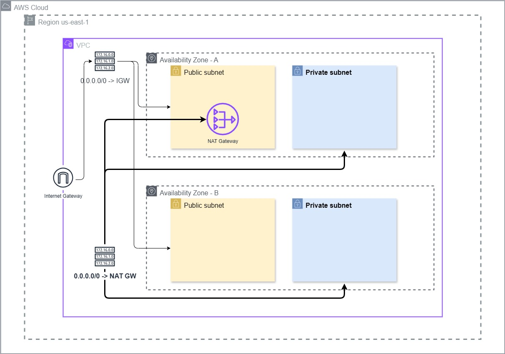
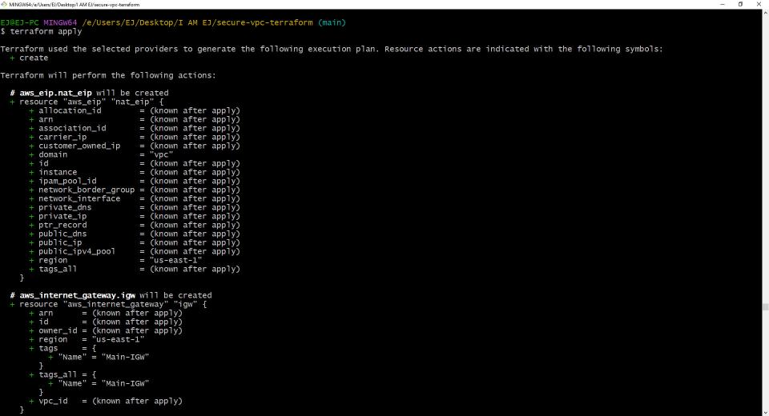
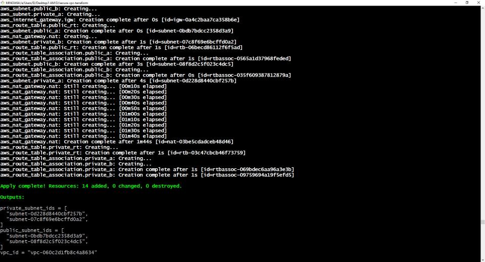
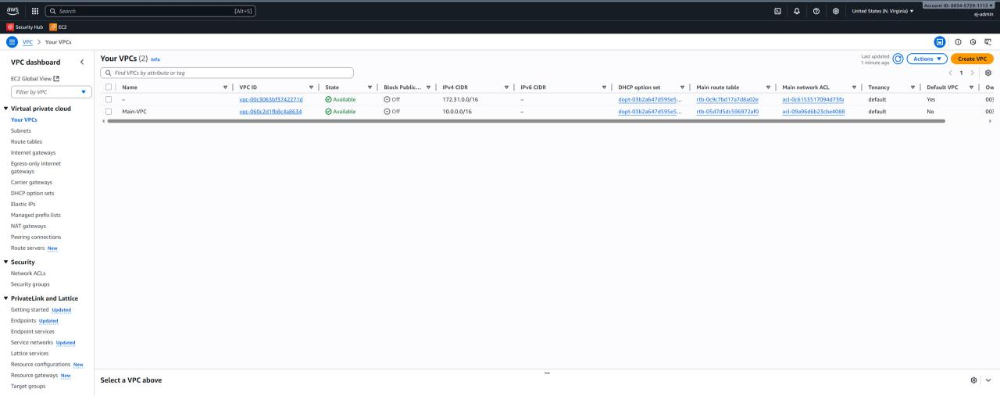
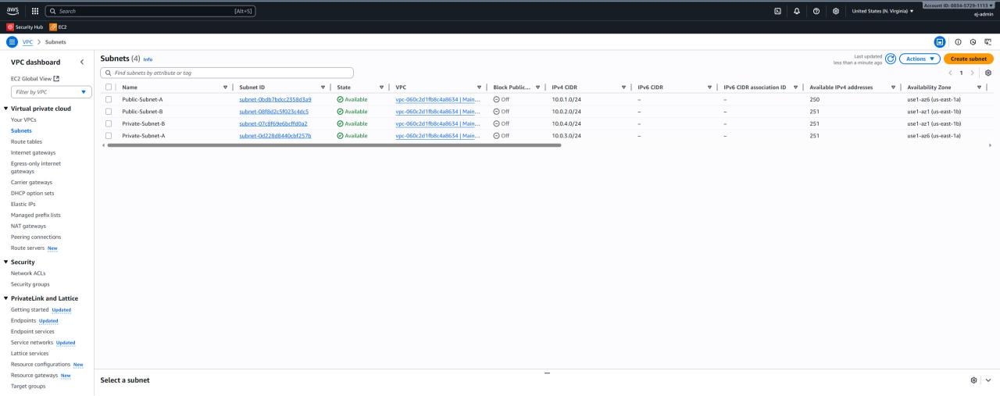
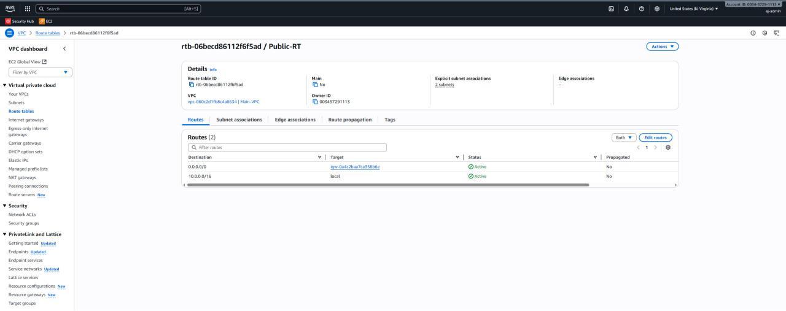

# Secure AWS VPC with Terraform

## Objective

This project demonstrates the use of Terraform to build a secure, highly available, and scalable network foundation on AWS. The infrastructure is defined entirely as code, showcasing a core competency in modern DevOps and Cloud Engineering practices.

## Architecture Diagram

This diagram represents the two-tier VPC architecture deployed by this Terraform code. It includes two public and two private subnets spread across two Availability Zones for high availability, with secure routing for each tier.



## Tools & Technologies Used

* **Terraform:** For defining and managing the infrastructure as code (IaC).
* **AWS CLI:** For authenticating to the AWS account.
* **AWS VPC:** The core networking service.
* **AWS EC2:** For networking components like Gateways.
* **Git & GitHub:** For version control and code management.
* **Markdown:** For project documentation.
---

## Description of Resources

This Terraform configuration deploys the following key resources:

* **VPC:** A logically isolated virtual network (`10.0.0.0/16`) to house all resources.
* **Availability Zones (x2):** The infrastructure is deployed across two AZs (`us-east-1a` and `us-east-1b`) to ensure high availability and fault tolerance.
* **Public Subnets (x2):** These subnets are for public-facing resources, such as web servers or load balancers.
* **Private Subnets (x2):** These subnets are for protected backend resources, such as databases and application servers, that should not be directly accessible from the internet.
* **Internet Gateway (IGW):** Provides a route to the internet for resources in the public subnets.
* **NAT Gateway:** Allows resources in the private subnets to initiate outbound connections to the internet (for software updates, etc.) while remaining unreachable from the public internet.
* **Route Tables:** Custom route tables are used to control the flow of traffic, ensuring public subnets route through the IGW and private subnets route through the NAT Gateway.

---

## Security Principles Applied
The design of this VPC is based on core security best practices:
* **Defense in Depth:** The multi-tier subnet structure (public/private) creates layers of security, protecting sensitive backend systems.

* **Principle of Least Privilege:** By placing resources in private subnets by default, we ensure they are not exposed to the internet unless absolutely necessary.

* **High Availability:** Deploying resources across two Availability Zones mitigates the risk of a single data center failure.


---

## Usage

### Prerequisites
* [Terraform](https://developer.hashicorp.com/terraform/downloads) installed.
* [AWS CLI](https://aws.amazon.com/cli/) installed and configured with appropriate credentials.

### Deployment Steps
1.  **Clone the Repository:**

    ```bash
    git clone [https://github.com/iamejdev/secure-vpc-terraform.git](https://github.com/iamejdev/secure-vpc-terraform.git)
    cd secure-vpc-terraform
    ```
2.  **Initialize Terraform:**
    This command downloads the necessary AWS provider plugins.

    ```bash
    terraform init
    ```
3.  **Plan the Deployment:**

    This command shows you a preview of the resources that will be created.

    ```bash
    terraform plan
    ```
4.  **Apply the Configuration:**
    This command builds and deploys the resources to your AWS account.

    ```bash
    terraform apply
    ```
### Teardown

To prevent ongoing AWS charges, it is important to destroy all infrastructure created by this project when no longer needed. The following command will remove all resources managed by this Terraform configuration.

```bash
terraform destroy
```
## Deployment Verification

The following screenshots confirm the successful deployment of the infrastructure as defined in the Terraform code.

### 1. Terraform CLI Output

The `terraform apply` command completed successfully, showing all resources created and the defined outputs.



### 2. VPC & Subnets
The "Main-VPC" and all four subnets (two public, two private) were created correctly across two Availability Zones.



### 3. Public & Private Route Tables

The route tables were configured to enforce the secure traffic flow. The public route table targets the Internet Gateway, while the private route table targets the NAT Gateway.


---

## Conclusion & Key Learnings

This project provided hands-on experience in translating an architectural design into functional Infrastructure as Code. A key takeaway was the importance of route tables in enforcing network segmentation and security. Building this VPC foundation with Terraform demonstrates a repeatable, scalable, and secure approach to modern cloud infrastructure management.